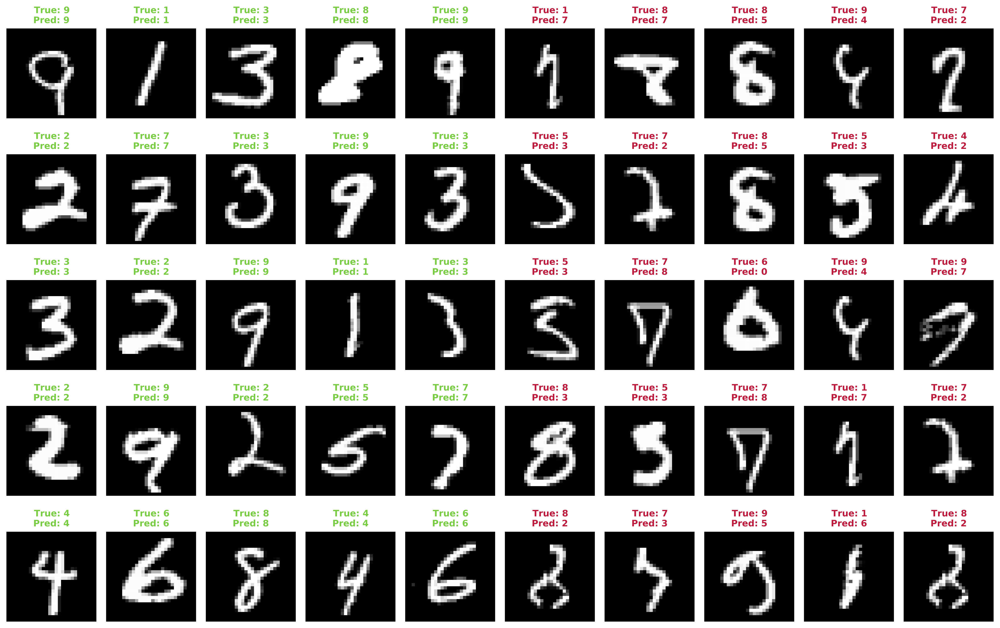

# MNIST-classification-LeNet5

## Goal
Classification of MNIST, FashionMNIST, KMNIST, and QMNIST datasets using the LeNet5 architecture.

## Architecture
The famous LeNet5 architecture in implemented with `Pytorch`. It's composed of two convolutional layers (Conv + ReLU + MaxPool) followed by three fully connected layers (400-120-84-10) with ReLU and a Softmax as final activation layer. Each model is trained 10 times with different seeds (1,2,3,4,5,6,7,8,9,10)

## Overall Performances

|     |      MNIST      | FashionMNIST | KMNIST | QMNIST |
|-----|-----------------|--------------|--------|--------|
|Train| 99.362 ± 0.085% |              |        |        |
|Test | 99.445 ± 0.077% |              |        |        |

\*Accuracy presented as _mean ± 1.96 std_
___
## MNIST
Digit recognition (0-9) from handwritten images (28x28 grayscale). The train set contains 60'000 examples and the test set contains 10'000 examples.

### Setup
The model is trained 10 times with the following parameters:

| N epoch | Learning rate | Batch Size | LR decay | Optimizer |
|---------|---------------|------------|----------|-----------|
| 150     | 0.002         |    128     |   0.98   |    ADAM   |

### Sample Prediction

___
## FashionMNIST
Cloth recognition from 28x28 grayscale images. There are 10 classes (T-Shirt/Top, Trouser, Pullover, Dress, Coat, Sandal, Shirt, Sneaker, Bag, Ankle boot). The train set contains 60'000 examples and the test set contains 10'000 examples.

### Setup
The model is trained 10 times with the following parameters:

| N epoch | Learning rate | Batch Size | LR decay | Optimizer |
|---------|---------------|------------|----------|-----------|
| 150     | 0.002         |    128     |   0.98   |    ADAM   |

___
## KMNIST
Handwritten Japanese Hiragana recognition from 28x28 grayscale images. There are 10 Hiragana in this dataset: &#12362; (a), &#12365; (ki), &#12377; (su), &#12388; (tu), &#12394; (na), &#12399; (ha), &#12414; (ma), &#12420; (ya), &#12428; (re), &#12434; (wo). The train set contains 60'000 examples and the test set contains 10'000 examples.

### Setup
The model is trained 10 times with the following parameters:

| N epoch | Learning rate | Batch Size | LR decay | Optimizer |
|---------|---------------|------------|----------|-----------|
| 150     | 0.002         |    128     |   0.98   |    ADAM   |

___
## QMNIST
Same dataset of Handwritten digits as MNIST but with more test examples. The train set contains 60'000 examples and the test set contains **60'000** examples.

### Setup
The model is trained 10 times with the following parameters:

| N epoch | Learning rate | Batch Size | LR decay | Optimizer |
|---------|---------------|------------|----------|-----------|
| 150     | 0.002         |    128     |   0.98   |    ADAM   |
